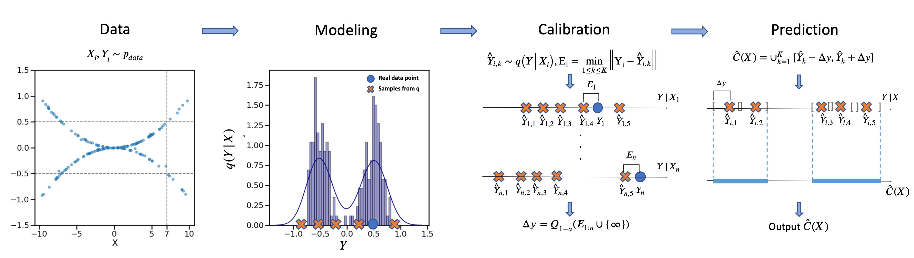

## Probabilistic Conformal Prediction &mdash; Official PyTorch implementation



**Probabilistic Conformal Prediction Using Conditional Random Samples**<br>
Zhendong Wang*, Ruijiang Gao*, Mingzhang Yin*, Mingyuan Zhou and David M. Blei <br>
https://arxiv.org/abs/2206.06584 <br>

Abstract: *This paper proposes probabilistic conformal prediction (PCP), a predictive inference algorithm
that estimates a target variable by a discontinuous predictive set. Given inputs, PCP construct
the predictive set based on random samples from an estimated generative model. It is efficient
and compatible with either explicit or implicit conditional generative models. Theoretically,
we show that PCP guarantees correct marginal coverage with finite samples. Empirically, we
study PCP on a variety of simulated and real datasets. Compared to existing methods for
conformal inference, PCP provides sharper predictive sets.*


## Reproduce Our Results

### Requirements
Please see `package_install.txt` to find how to set up the python environment. In short words, 
* 64-bit Python 3.6.
* PyTorch 1.8.0. See [https://pytorch.org/](https://pytorch.org/) for PyTorch install instructions.
* scikit-learn=0.21.3 and scikit-garden.
* Python libraries: `pip install sympy cde tqdm pandas shapely matplotlib seaborn`.

### Data Preparation

In our paper, following [CQR repo](https://github.com/yromano/cqr) and [CHR repo](https://github.com/msesia/chr), we trained our PCP and HD-PCP model on 

1) Publicly Available Datasets:
[Bike](https://archive.ics.uci.edu/ml/datasets/bike+sharing+dataset), [Bio](https://archive.ics.uci.edu/ml/datasets/Physicochemical+Properties+of+Protein+Tertiary+Structure),
[Blogdata](https://archive.ics.uci.edu/ml/datasets/BlogFeedback), [facebook1](https://archive.ics.uci.edu/ml/datasets/Facebook+Comment+Volume+Dataset), [facebook2](https://archive.ics.uci.edu/ml/datasets/Facebook+Comment+Volume+Dataset) and [temperature](https://archive.ics.uci.edu/ml/datasets/Bias+correction+of+numerical+prediction+model+temperature+forecast).
2) Data subject to copyright/usage rules: 
[MEPS_19](https://meps.ahrq.gov/mepsweb/data_stats/download_data_files_detail.jsp?cboPufNumber=HC-181),
[MEPS_20](https://meps.ahrq.gov/mepsweb/data_stats/download_data_files_detail.jsp?cboPufNumber=HC-181) and
[MEPS_21](https://meps.ahrq.gov/mepsweb/data_stats/download_data_files_detail.jsp?cboPufNumber=HC-181).

You can download the datasets we used in our paper at their respective websites and get more information about these datasets there. For simple use and reproduction, we provide our downloaded datasets in `data` folder. 

### Run Expriements

The running command could be as simple as:
```.bash
python main.py --dataset bike --n_runs 10 --n_parallel 1 --K 50 --fr 0.2
```
Now, the code is run only on `cpu` since the hidden models are all simple and small but could be easily modified to be run on `gpu`. The running configuration can be customized with command line options:
* `--n_runs` number of running with different seeds.
* `--n_parallel` number of parallelly jobs for each serial running. 
* `--K` the sample size of PCP.
* ` --fr` the filtering ratio of PCP. We usually recommend 0.2. 

To run multi-dimensional tasks, simply change to `main_md.py` file. Currently, `main.py` will include all baselines and our methods for running. If you just simply want the results of our methods, such as PCP or HD-PCP, comment out the other methods and the corresponding hidden model training in `main.py` file. 

## Citation

```
@InProceedings{wang2022pcp,
  author    = {Wang, Zhendong and Gao, Ruijiang and Yin, Mingzhang and Zhou, Mingyuan and Blei, David M.},
  title     = {Probabilistic Conformal Prediction Using Conditional Random Samples},
  journal   = {arXiv.org},
  volume    = {abs/2206.06584},
  year      = {2022},
  url       = {https://arxiv.org/abs/2206.06584},
}
```

## Acknowledgements

We thank [CQR repo](https://github.com/yromano/cqr) and [CHR repo](https://github.com/msesia/chr) for providing good code examples. 
